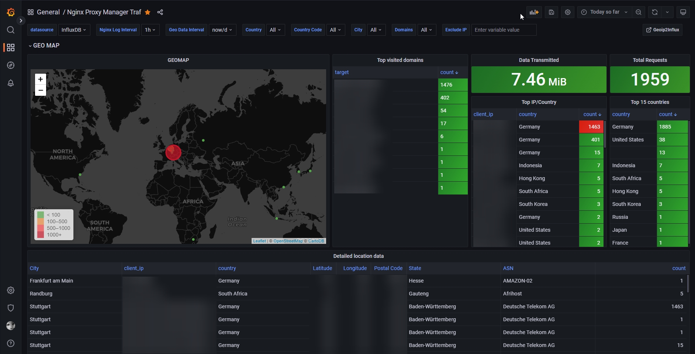

# nginxproxymanager-traf

[](https://drone.it-lampe.de/rexlManu/nginxproxymanager-traf)
[](https://hub.docker.com/r/rexlmanu/nginxproxymanager-traf)

Log your access logs from [nginxproxymanager](https://github.com/NginxProxyManager/nginx-proxy-manager) traffic to influxdb for grafana.

## Example usage case


## Setup

Download the GeoLite2 databases from [maxmind.com](https://www.maxmind.com/en/geolite2/) or via the script.
Create a nginx folder in your current pwd with a nginx.conf file inside.

```bash
docker run -d --name nginxproxymanager-traf \
    -e INFLUXDB_URL=influxdb \
    -e INFLUXDB_TOKEN=influxdb \
    -e INFLUXDB_BUCKET=influxdb \
    -e INFLUXDB_ORG=influxdb \
    -v nginx-logs:/logs \
    -v $(pwd)/GeoLite2-City.mmdb:/app/GeoLite2-City.mmdb \
    -v $(pwd)/GeoLite2-ASN.mmdb:/app/GeoLite2-ASN.mmdb \
    -v $(pwd)/nginx/:/app/nginx/ \
    --restart=unless-stopped \
    rexlmanu/nginxproxymanager-traf
```

## Point
```go
// geo specific data will be empty if it's a local / internal IP
NewPoint("nginx_access_log", map[string]string{
    "target":      host,
    "client_ip":   remoteAddr,
    "city":        cityName,
    "state":       stateName,
    "country":     country,
    "latitude":    fmt.Sprintf("%f", latitude),
    "longitude":   fmt.Sprintf("%f", longitude),
    "postal_code": postalCode,
    "asn":         asn,
}, map[string]interface{}{
    "upstream_status": upstreamStatus,
    "status":          status,
    "method":          requestMethod,
    "scheme":          scheme,
    "target":          host,
    "uri":             requestUri,
    "client_ip":       remoteAddr,
    "body_bytes":      parseInt,
    "gzip_ratio":      gzipRation,
    "server":          server,
    "user_agent":      httpUserAgent,
    "referer":         httpReferer,
    "request_time":    timeString,
    "city":            cityName,
    "state":           stateName,
    "country":         country,
    "latitude":        latitude,
    "longitude":       longitude,
    "postal_code":     postalCode,
    "asn":             asn,
}, time)
```

## Contributing
Pull requests are welcome. For major changes, please open an issue first to discuss what you would like to change.

## License
[MIT](LICENSE)
